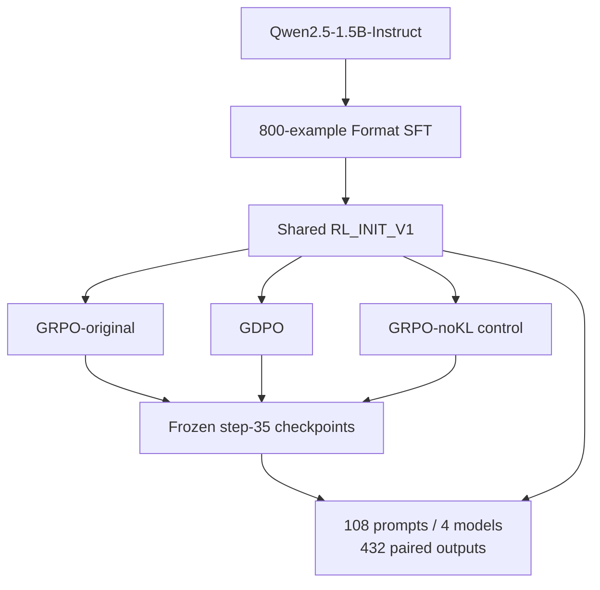

# ToolPostTrain — Tool-Calling LLM Post-Training

**English** | [简体中文](README.zh-CN.md)

Built a **Format SFT + GRPO/GDPO** pipeline for **Qwen2.5-1.5B-Instruct** with veRL/vLLM, traced a KL mismatch in the implemented objectives, and added a matched GRPO-noKL control.

**Stack:** PyTorch · veRL · vLLM · LoRA · FSDP · single RTX 6000D

**Status:** completed SFT, three 35-step RL runs and the four-model final evaluation.

## Core Contributions

- **Ran real LLM post-training:** prepared **800 Format-SFT examples**, built the shared **RL_INIT_V1**, and completed **GRPO-original, GDPO and GRPO-noKL** training with a common budget.
- **Found a comparison confound in source code:** traced **reward → advantage → actor loss → optimizer**; matching KL flags concealed different reward consumption paths. Designed the **GRPO-noKL** control to align objective-level KL treatment.
- **Measured the outcome:** completed **108 prompts × 4 models = 432** frozen evaluations. All three RL checkpoints gained about **+0.53 raw reward** over initialization on the internal endpoint.

## Results

One greedy answer per model per prompt on **FINAL_HOLDOUT_V1**; means and deltas rounded to three decimals.

| Model | Raw total reward | Δ vs RL_INIT |
|---|---:|---:|
| RL_INIT_V1 | 2.417 | — |
| GRPO-original35 | 2.946 | +0.529 |
| GDPO-current35 | 2.956 | +0.540 |
| GRPO-noKL35 | 2.945 | +0.529 |

**GDPO − GRPO-noKL: +0.011.** The paired interval includes zero, so this experiment does not establish a clear extra benefit from GDPO. The three RL-minus-initialization intervals are above zero on this endpoint.

Raw total reward is accuracy reward + format reward; it is a scorer value, **not an accuracy percentage**. [Full paired-bootstrap results and component scores →](reports/final_holdout_v1/completion_report.md)

## Key Technical Finding

> **Same configuration flags did not imply the same optimization objective.**

In the pinned implementation, both original runs enabled `use_kl_in_reward`. **GRPO consumed KL-adjusted aggregate rewards**, while the configured **GDPO path built advantages from raw accuracy/format components**. The initial comparison therefore mixed advantage construction with KL treatment.

I added **GRPO-noKL** as the objective-level KL-aligned reference, keeping the initialization, data order, training budget and evaluation schedule matched. [Source-path audit →](docs/diagnostics/gdpo_hidden_kl_use_final_audit.md)

## Pipeline



## What I Built

| Contribution | My work |
|---|---|
| **Post-training pipeline** | Adapted the Blackwell/SM120 environment and single-GPU launch configuration; completed Format SFT and three real RL runs with veRL/vLLM. |
| **Objective-path audit** | Followed reward tensors, component extras, advantage dispatch and actor loss to identify the KL-treatment mismatch. |
| **Controlled ablation** | Added GRPO-noKL and checked effective configurations against the original run to control the main KL confound. |
| **Held-out evaluation** | Froze four model identities and 108 prompts; completed scorer checks and paired-bootstrap analysis of 432 outputs. |

Algorithms and reproduction code come from **NVlabs/GDPO**, the executed trainer from **official veRL**, task data/rewards from **ToolRL**, and the base model from **Qwen**. My contribution is the adaptation, audit, controls and evaluation.

## Experimental Setup

| Item | Setting |
|---|---|
| Base model / RL initialization | Qwen2.5-1.5B-Instruct / merged 800-example Format SFT |
| Algorithms | GRPO-original / GDPO / GRPO-noKL |
| RL budget | 35 training steps per run; 512 prompts/batch; 4 rollouts/prompt |
| Learning rate / training seed | 1e-6 / 42 |
| Runtime | veRL + vLLM; one RTX 6000D |
| Final evaluation | 108 prompts × 4 models; greedy n=1 |

## Scope

This is a **single-seed, 35-step** study on a **post-hoc internal holdout** selected from the exposure-audited, optimizer-unused train-split tail. It does not establish GDPO superiority, algorithm equivalence or multi-seed robustness; the task scores tool-call outputs without live tool execution. [Endpoint provenance and full limitations →](reports/final_holdout_v1/completion_report.md)

## Read More

- [Final results](reports/final_holdout_v1/completion_report.md): exact metrics and all paired comparisons.
- [Results & evidence index](reports/README.md): training reports, KL audit and final protocol.

All **432** outputs passed frozen row mapping and scorer recomputation checks. Protocols, identities and hashes are linked in the evidence index; raw outputs, datasets and weights remain outside Git.

<details>
<summary>Repository and local checks</summary>

`configs/` and `manifests/` record settings and identities; `scripts/` holds entrypoints and checks; `reports/` holds results; `docs/` holds protocols and technical audits. The upstream code trees are preserved.

```bash
bash setup-local.sh
bash 运行本地验证.command
```

These are local CPU checks. Historical GPU launchers depend on the recorded server layout and separately retained data/models.

Based on [NVlabs/GDPO](https://github.com/NVlabs/GDPO); see [upstream README](README.upstream.md), [LICENSE](LICENSE) and [third-party license](third_party_dependency.LICENSE).

</details>
