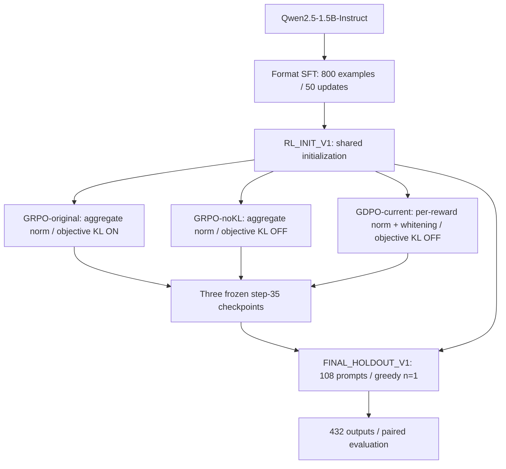

# ToolPostTrain

### Reproducing and Auditing Multi-Reward RL Post-Training for Tool Calling

**Format SFT → GRPO/GDPO → KL-path audit → matched no-KL ablation → held-out paired evaluation**

大模型工具调用后训练：GRPO/GDPO 复现、KL 目标路径审计与受控消融。

**Completed:** three **35-step** RL runs · **108** internal holdout prompts · **432** formal generations.

[Final results](reports/final_holdout_v1/completion_report.md) · [KL objective audit](docs/diagnostics/gdpo_hidden_kl_use_final_audit.md) · [Evidence index](reports/README.md)

## Highlights

- Ran real GRPO/GDPO post-training of **Qwen2.5-1.5B-Instruct** with modern **veRL/vLLM** on one **RTX 6000D**.
- Built a lightweight **Format SFT** stage to establish a shared initialization for ToolRL's strict output contract.
- Traced **reward → advantage → optimizer** and identified different reward-side KL consumption despite matching configuration flags.
- Added a **matched GRPO-noKL control**: the three RL checkpoints gained about **+0.53 raw reward** over initialization on this internal endpoint, without establishing a clear GDPO advantage over the KL-aligned reference.

## What I Built

**Upstream foundations:** NVlabs/GDPO supplies the algorithm/reproduction code; official veRL supplies the executed trainer; ToolRL supplies the task data and reward contract; Qwen supplies the base model.

My engineering and research contributions:

| Contribution | Concrete work |
|---|---|
| Modern training stack | Adapted environment setup and launch configuration for Blackwell/SM120, FSDP, SDPA and vLLM; validated real optimizer updates and completed single-GPU training. |
| Shared RL initialization | Audited prompts and scorer expectations; prepared 800 Format-SFT examples, ran one LoRA epoch / 50 updates, and validated the merged **RL_INIT_V1**. |
| Objective-path audit | Followed reward tensors, raw component extras, advantage dispatch and policy loss to identify the **KL-treatment confound**. |
| Controlled ablation | Designed and ran **GRPO-original35, GDPO-current35 and GRPO-noKL35** from the same initialization with a shared budget and evaluation schedule. |
| Mechanism diagnostics | Compared advantages on shared rollouts and checked reward-dimension conflicts in a separate sampled diagnostic. |
| Paired evaluation | Froze four model identities and an internal endpoint; completed **432** outputs, exact scorer checks and paired-bootstrap analysis. |

The project combines upstream algorithm reproduction with an audit of what the implemented objectives actually compare.

## Research Question

Does GDPO's per-reward advantage construction yield a measurable benefit over a **KL-aligned GRPO reference** in format-aligned tool-calling post-training?

For the KL-free comparison, the constructions are schematically:

$$
R = R_{\mathrm{accuracy}} + R_{\mathrm{format}}, \qquad
A_{\mathrm{GRPO}} = \operatorname{GroupNorm}(R)
$$

$$
A_{\mathrm{GDPO}} \approx \operatorname{MaskedWhiten}_{\mathrm{batch}}\!\left(
\operatorname{GroupNorm}(R_{\mathrm{accuracy}}) +
\operatorname{GroupNorm}(R_{\mathrm{format}})\right)
$$

GroupNorm operates within a prompt's rollout group; GDPO additionally whitens over valid response tokens. The diagram and equations summarize the complete constructions; the comparison does not isolate per-dimension normalization from batch whitening.

## Pipeline



Here **objective KL** means consumption of the reference-policy reward penalty by the update, not the configuration flag or PPO's logged KL diagnostic.

## Main Results

**FINAL_HOLDOUT_V1:** a frozen **post-hoc internal holdout**, evaluated after the 35-step budget and four model identities were fixed. Each model generated one greedy answer on the same **108** prompts, for **432/432** formal outputs.

| Model | Raw total reward | Accuracy reward | Format reward | Δ total vs RL_INIT |
|---|---:|---:|---:|---:|
| RL_INIT_V1 | 2.416575 | 1.490650 | 0.925926 | — |
| GRPO-original35 | 2.945898 | 2.001453 | 0.944444 | +0.529322 |
| GDPO-current35 | 2.956086 | 2.002382 | 0.953704 | +0.539511 |
| GRPO-noKL35 | 2.945284 | 2.000839 | 0.944444 | +0.528708 |

These are raw scorer rewards; **accuracy reward is a score, not an accuracy percentage**. Total reward is accuracy reward + format reward, without a reference-policy KL penalty in evaluation.

Selected primary comparisons, with the direction written explicitly:

| Comparison | Mean Δ total reward | Paired bootstrap 95% CI |
|---|---:|---:|
| GDPO − GRPO-noKL | +0.010802 | [−0.096605, +0.165432] |
| GRPO-original − RL_INIT | +0.529322 | [+0.303721, +0.788203] |
| GDPO − RL_INIT | +0.539511 | [+0.302045, +0.815225] |
| GRPO-noKL − RL_INIT | +0.528708 | [+0.303088, +0.782164] |

> **Key finding:** All three RL-minus-initialization intervals are above zero on this fixed internal endpoint. All three RL-versus-RL intervals include zero; the experiment does not establish a clear GDPO advantage over KL-aligned GRPO, and does not establish algorithm equivalence.

The analysis uses **10,000 common paired resamples**, seed 42, with percentile intervals. These describe prompt-sample variation for fixed checkpoints, not variability across training seeds. [All six predeclared comparisons and component metrics](reports/final_holdout_v1/metrics_and_paired_comparisons.json) are retained; the table above is a reading guide, not a revised analysis.

## Why the KL Audit Matters

Both original training configurations set `algorithm.use_kl_in_reward=true`. The executed code paths differed:

```text
scorer → aggregate token_level_scores + raw accuracy/format components
       → token_level_rewards = token_level_scores − β × reference KL

GRPO → KL-adjusted token_level_rewards → group-normalized advantages
GDPO → raw accuracy_reward / format_reward → per-component norm → whitening
     → advantages → actor policy loss → optimizer update
```

With the configured reward keys, GDPO uses the raw components rather than the KL-adjusted aggregate. The separate actor KL loss is disabled in all three runs. GDPO still computes the reference path and logs KL-adjusted statistics; **its enabled reward-side KL flag does not put that penalty into this component-based objective**.

That makes **GRPO-original vs GDPO** a comparison of both advantage construction and KL treatment. I added **GRPO-noKL**, changing the reward-side KL flag to false, to provide the objective-level KL-aligned reference.

| Run | Advantage construction | Reward-side KL in update | Training flag |
|---|---|---|---|
| GRPO-original | Aggregate reward → group norm | Yes | `use_kl_in_reward=true` |
| GRPO-noKL | Aggregate reward → group norm | No | `use_kl_in_reward=false` |
| GDPO-current | Raw component norms → sum → masked whitening | No, in the configured component branch | `use_kl_in_reward=true` |

**Matching flags is not enough to establish matching objectives.** The [source-path audit](docs/diagnostics/gdpo_hidden_kl_use_final_audit.md) and [original/noKL configuration diff](docs/diagnostics/grpo_original_vs_grpo_nokl_effective_config_diff.md) document the control. Disabling reward KL also removes reference-policy computation under veRL's semantics, so wall-clock differences are not a pure estimator-efficiency comparison.

## Experimental Design

| Shared setting | Value |
|---|---|
| Model / initialization | Qwen2.5-1.5B-Instruct / merged Format-SFT **RL_INIT_V1** |
| Training data | ToolRL `rlla_4k`: 3,920 raw rows → 3,901 eligible; first 3,584 enter each epoch |
| Order / batching | `shuffle=false`, `drop_last=true`; 512 prompts per training batch |
| Budget | **35 training steps** = 5 epochs × 7 batches; each run starts afresh from RL_INIT |
| Rollouts / PPO minibatch | 4 sampled trajectories per prompt / 128 prompts |
| Optimizer / seed | AdamW, learning rate **1e-6** / **42**, one training seed |
| Length limits | Prompt **2,048** / response **1,024** tokens |
| Single-GPU execution | FSDP; physical microbatch 1; dynamic token budget 6,144; vLLM TP=1 |
| In-training validation | Fixed 80-row endpoint at steps 0/7/14/21/28/35; greedy n=1 |
| Final evaluation | Frozen step35 models + RL_INIT; 108 rows; greedy n=1, temperature=0 |

The base model struggled with the strict ToolRL contract in the [initial diagnostic](reports/sft/sft_v2_after_reward_report.md), motivating Format SFT before RL. The [SFT report](reports/sft/sft_v2_train_report.md) and [merge checks](reports/comparison/rl_init_merge_validation.md) record the shared initialization; runtime-LoRA and merged outputs were not asserted to be bitwise identical.

[Training curves and canonical validation scores](reports/comparison/grpo_gdpo_nokl_stage1_35_comparison.md) remain separate from the final results above. The validation set's known duplicate-content row is covered by a [post-hoc 80/79 sensitivity analysis](reports/comparison/primary80_vs_sensitivity79_stage1_35.md). The [35-step closeout](docs/experiment_design/stage1_closeout_decision.md) is a budget decision, not a convergence claim.

## Mechanism Diagnostics

- **Shared rollouts:** on 8 prompts × 4 trajectories, GDPO changed advantage magnitude, centering and sample weighting. There were **no substantive within-group ranking reversals** under the documented tolerance. [Diagnostic and interpretation correction](reports/comparison/grpo_gdpo_shared_rollout_diagnostic.md).
- **Reward conflict:** a separate sampled Format-SFT pilot contained **8/128** trajectories with opposing centered accuracy/format signs, across **6/32** groups. This measures that diagnostic sample, not conflict frequency during formal training. [Reward-variation report](reports/sft/fresh_holdout_reward_variation.md).
- **Plausible mechanism hypothesis:** high greedy-validation format scores and limited observed conflict may leave little room for per-dimension normalization to improve endpoint scores. Sampled rollouts still have format variation; training-time saturation and a causal explanation were not established.

These diagnostics expose implementation behavior while the paired results bound the downstream claim.

## Technical Deep Dives

1. [Why GRPO/GDPO KL handling was confounded](docs/diagnostics/gdpo_hidden_kl_use_final_audit.md)
2. [Why Format SFT was needed, and what changed](reports/sft/sft_v2_after_reward_report.md)
3. [GRPO vs GDPO advantage construction on shared rollouts](reports/comparison/grpo_gdpo_shared_rollout_diagnostic.md)
4. [Reward-dimension conflict and its measurement boundary](reports/sft/fresh_holdout_reward_variation.md)
5. [Final paired evaluation, all comparisons and interpretation](reports/final_holdout_v1/completion_report.md)

## Limitations

- **One training seed, 35 steps:** the intervals do not measure seed robustness or longer-budget behavior.
- **Post-hoc internal holdout:** selected under a persisted exposure audit from the optimizer-unused train-split tail; shares its source pool with validation.
- **Task scope:** an internal tool-call scoring task, not an official unseen ToolRL test or an external benchmark.
- **Objective scope:** GDPO/noKL compares complete advantage constructions, including whitening; per-dimension normalization is not isolated causally.
- **Agent scope:** no live tool execution or interactive Agent environment; format/parse rewards do not measure end-to-end task success.

## Reproducibility / Experimental Integrity

The final matrix passed **108/108 unique mappings per model**, with no missing or duplicate rows. All **432** outputs were recomputed with the pinned scorer: finite rewards and **zero discrepancies** in all three persisted reward fields. Evaluation performed no training or optimizer updates.

During final evaluation, execution failures were preserved and repaired without regenerating existing model outputs or modifying the frozen protocol. [Completion and technical audit](reports/final_holdout_v1/completion_report.md) records the preserved RL_INIT answers and engineering repairs.

| Evidence | Entry point |
|---|---|
| Frozen endpoint / runtime mapping | [Endpoint manifest](manifests/final_holdout_v1_manifest.json) · [Mapping](manifests/final_holdout_v1_runtime_mapping.json) |
| Frozen models / scorer | [Model identities](manifests/final_test_models_manifest.json) · [Scorer identity](manifests/final_test_scorer_manifest.json) |
| Actual configuration / runtime | [Integrity records via completion gate](reports/final_holdout_v1/completion_gate.json) · [Runtime versions](reports/final_holdout_v1/runtime_environment.json) |
| Frozen protocol / analysis | [Protocol](docs/experiment_design/final_test_protocol.md) · [Analysis script](scripts/analyze_final_test.py) |
| Private archive verification | [Archive receipt](reports/final_holdout_v1/archive_receipt.json) |
| Historical exposure / content overlap | [Historical usage audit](docs/diagnostics/final_test_historical_usage_audit.md) · [Holdout freeze audit](docs/diagnostics/final_holdout_v1_freeze_audit.md) |
| Presentation claim checks | [Claim audit](docs/diagnostics/github_presentation_claim_audit_20261003.md) |

Executed trainer: official veRL v0.9.1 at `1876b06d0a3e4e71e06230be10af14492ca8a75b`. Final launcher commit: `066e158639bcebdc79131e7ab0180d11ef021aaf`. File and output SHA256 values are retained in the completion gate.

Git contains compact reports, configs, manifests and audit code. Raw formal outputs, datasets, weights and optimizer state are intentionally kept outside Git; the private evaluation archive was independently verified. Public validation aggregates are archived evidence; this presentation revision does not recompute their bootstrap or the final analysis.

For local CPU-only checks:

```bash
bash setup-local.sh
bash 运行本地验证.command
```

Historical GPU launchers depend on the recorded server layout and separately retained data/models; they are not a portable one-command reproduction. The frozen experiment is complete.

## Repository Map & Attribution

| Path | Purpose |
|---|---|
| `configs/`, `manifests/` | Recorded settings and frozen identities |
| `scripts/` | Setup, training/evaluation entrypoints and technical checks |
| `reports/` | Results, training records, objective audits and diagnostics |
| `docs/` | Protocols, experiment design, deeper explanations and [personal interview preparation](docs/resume_project_summary.md) |
| `verl-GDPO/`, `trl-GDPO/`, `nemo_rl-GDPO/` | Preserved upstream reproduction trees |

Based on [NVlabs/GDPO](https://github.com/NVlabs/GDPO), pinned at `4ad86b4fbfc5db594f3a2750ff9c39fdc8ee6115`; see [README.upstream.md](README.upstream.md). Algorithms are attributed to upstream; project contributions are the adaptation, audits, controls and evaluation above. License: [LICENSE](LICENSE) and [third-party dependency license](third_party_dependency.LICENSE).
