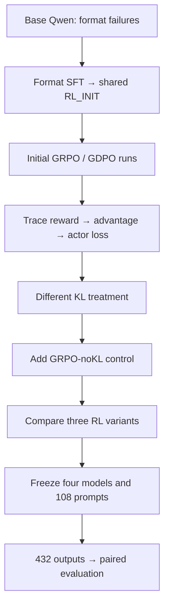

# ToolPostTrain

**English** | [简体中文](README.zh-CN.md)

### Controlled GRPO/GDPO Post-Training for Tool Calling

I ran tool-calling post-training on **Qwen2.5-1.5B-Instruct**, found a KL mismatch in the initial GRPO/GDPO comparison, and added a **GRPO-noKL control**. Three RL checkpoints improved over the shared initialization on the internal holdout; GDPO showed no clear extra gain over the KL-aligned control.

**Completed:** 800-example Format SFT · three 35-step RL runs · 432 final outputs.

**Stack:** PyTorch · veRL · vLLM · LoRA · FSDP · one RTX 6000D.

## What I did

- **Ran the training:** adapted the upstream GRPO/GDPO setup for veRL/vLLM on a single Blackwell GPU and completed three RL runs.
- **Established a shared starting point:** diagnosed failures to follow ToolRL's strict output format, prepared 800 Format-SFT examples, and merged the LoRA checkpoint into **RL_INIT_V1**.
- **Checked what the algorithms actually optimized:** traced reward tensors through advantage construction and actor loss, found different KL treatment, and designed **GRPO-noKL** to control that difference.
- **Compared behavior and outcomes:** examined advantages on shared rollouts and reward conflicts in a separate sample, then froze four model identities and evaluated all of them on the same 108 prompts.

Upstream supplied the Qwen model, ToolRL data/rewards, GRPO/GDPO implementations and veRL trainer. My work was the environment adaptation, format initialization, objective audit, control experiment, diagnostics and final evaluation.

### Why I started with Format SFT

In the initial diagnostic, the base model often failed the required output structure. That made protocol compliance a separate problem from tool-call quality. I checked the prompt/scorer contract, then used a short Format-SFT warmup to give all RL runs the same starting point. [Before/after diagnostic →](reports/sft/sft_v2_after_reward_report.md)

## Key Technical Finding

> **Same configuration flags did not imply the same optimization objective.**

Both initial runs set `use_kl_in_reward=true`. Following the implemented reward → advantage → actor-loss path, I found that GRPO used KL-adjusted rewards, while the configured GDPO branch read the raw reward components:

```text
GRPO: KL-adjusted token-level rewards → group normalization → policy update
GDPO: raw accuracy/format components → per-component normalization → whitening → policy update
```

The original comparison changed **both advantage construction and KL treatment**. I therefore added **GRPO-noKL**, matching the initialization, data order, training budget and evaluation schedule while removing reward-side KL from its update. This gave me a KL-aligned comparison with GDPO. [Source-path audit →](docs/diagnostics/gdpo_hidden_kl_use_final_audit.md)

## Main Results

I froze **FINAL_HOLDOUT_V1** and evaluated four fixed models on the same **108 prompts**, with one greedy answer per prompt: **432 outputs** in total.

| Model | Why I included it | Raw total reward | Δ vs RL_INIT |
|---|---|---:|---:|
| RL_INIT_V1 | Shared Format-SFT initialization | 2.417 | — |
| GRPO-original35 | Original GRPO reference; reward-side KL active | 2.946 | +0.529 |
| GDPO-current35 | Per-reward advantage construction | 2.956 | +0.540 |
| GRPO-noKL35 | My control for the KL mismatch | 2.945 | +0.529 |

All three RL checkpoints gained about **+0.53 raw reward** over RL_INIT; their paired intervals are above zero on this endpoint. **GDPO − GRPO-noKL was +0.011**, with a paired interval crossing zero. I found no clear additional benefit from GDPO in this setting; that result does not establish algorithm equivalence.

Values are rounded to three decimals. Raw total reward is accuracy reward + format reward, **not an accuracy percentage**. [Exact scores and all paired comparisons →](reports/final_holdout_v1/completion_report.md)

## How I arrived at the comparison



## What I observed inside the optimization

On **8 prompts × 4 shared rollouts**, GDPO changed advantage scale, centering and sample weighting. There were no substantive within-group ranking reversals at the documented tolerance. A separate sampled diagnostic contained opposing centered accuracy/format signals in **8/128 trajectories**, across **6/32 groups**.

These checks helped distinguish a numerical change in credit assignment from an observed downstream gain. High greedy-validation format scores and the limited conflicts in these diagnostic samples suggest a **plausible mechanism hypothesis** for the small endpoint difference. They do not establish training-time format saturation or a causal explanation. [Shared-rollout diagnostic](reports/comparison/grpo_gdpo_shared_rollout_diagnostic.md) · [Reward-conflict diagnostic](reports/sft/fresh_holdout_reward_variation.md)

## What I learned

- I addressed output-format failures before comparing RL methods, using one shared SFT initialization.
- Tracing the reward consumers changed how I interpreted the initial comparison: matching flags had left a KL confound in place.
- After adding the control, I could report a bounded result: RL improved over initialization here, while GDPO's different advantage construction did not produce a clear gain over KL-aligned GRPO.

## Experimental Setup

| Item | Setting |
|---|---|
| Model / initialization | Qwen2.5-1.5B-Instruct / merged Format SFT, 800 examples |
| RL variants | GRPO-original / GDPO / GRPO-noKL |
| Budget / rollouts | 35 training steps per run; 512 prompts/batch; 4 rollouts/prompt |
| Learning rate / training seed | 1e-6 / 42 |
| Runtime | veRL + vLLM; one RTX 6000D |
| Final evaluation | 108 prompts × 4 fixed models; greedy n=1 |

## Technical Details

- [KL objective audit](docs/diagnostics/gdpo_hidden_kl_use_final_audit.md) and [original/noKL configuration diff](docs/diagnostics/grpo_original_vs_grpo_nokl_effective_config_diff.md): reward consumers and what the control changed.
- [SFT report](reports/sft/sft_v2_train_report.md) and [three-run training comparison](reports/comparison/grpo_gdpo_nokl_stage1_35_comparison.md): initialization and validation curves.
- [Final evaluation report](reports/final_holdout_v1/completion_report.md) and [evidence index](reports/README.md): exact results, frozen protocol and supporting records.

## Limitations

- **One training seed:** paired intervals measure prompt-sample variation for fixed checkpoints, not variation across training seeds.
- **35-step budget:** this is the chosen training budget, not a convergence claim.
- **Post-hoc internal holdout:** selected from the exposure-audited, optimizer-unused train-split tail; it shares its source pool with validation.
- **Task scope:** tool-call output scoring, without live tool execution or an external benchmark.

## Reproducibility and Attribution

All formal outputs passed frozen row-mapping and scorer-recomputation checks. Execution failures were preserved, with existing answers retained through engineering repairs. [Protocol and technical audit →](reports/final_holdout_v1/completion_report.md)

I built on [NVlabs/GDPO](https://github.com/NVlabs/GDPO), official veRL, ToolRL and Qwen. Algorithm and framework authorship belongs to upstream; my contributions are described above. See [upstream README](README.upstream.md), [LICENSE](LICENSE) and [third-party license](third_party_dependency.LICENSE).

<details>
<summary>Repository layout and local checks</summary>

`configs/` and `manifests/` record settings and identities; `scripts/` holds entrypoints and checks; `reports/` holds results; `docs/` holds protocols and technical audits. Raw outputs, datasets and weights remain outside Git.

```bash
bash setup-local.sh
bash 运行本地验证.command
```

These are CPU checks. Historical GPU launchers depend on the recorded server layout and separately retained data/models.

</details>
