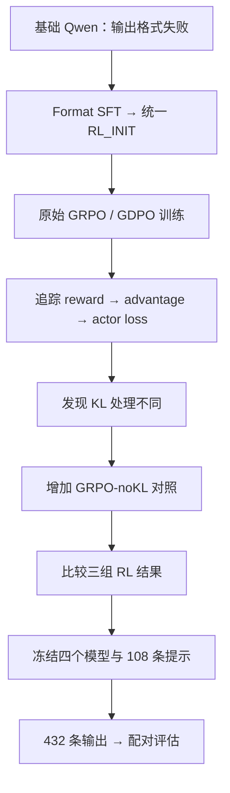

# ToolPostTrain

[English](README.md) | **简体中文**

### 工具调用模型的 GRPO/GDPO 后训练与对照实验

我在 **Qwen2.5-1.5B-Instruct** 上完成了工具调用后训练，通过源码追踪发现原始 GRPO/GDPO 比较中的 KL 处理并不一致，因此补充了 **GRPO-noKL 对照**。最终，三个 RL checkpoint 在内部留出集上均优于统一初始化，但 GDPO 相对 KL 对齐的参照没有清晰的额外收益。

**已完成：** 800 样本 Format SFT · 三组 35-step RL 训练 · 432 条最终输出。

**技术栈：** PyTorch · veRL · vLLM · LoRA · FSDP · 单张 RTX 6000D。

## 我做了什么

- **完成真实训练：** 将上游 GRPO/GDPO 配置适配到 veRL/vLLM 单卡训练环境，在单张 Blackwell GPU 上完成三组 RL 训练。
- **建立统一起点：** 诊断基础模型未能遵循 ToolRL 严格输出格式的问题，准备 800 条 Format-SFT 样本，将 LoRA checkpoint 合并为 **RL_INIT_V1**。
- **核对实际优化目标：** 从 reward tensor 追到 advantage 构造和 actor loss，发现 KL 处理差异，并设计 **GRPO-noKL** 控制这一因素。
- **比较优化行为与最终结果：** 检查共享 rollouts 的 advantage，以及另一组样本中的奖励冲突；随后冻结四个模型身份，在相同 108 条提示上完成评估。

Qwen 模型、ToolRL 数据与奖励、GRPO/GDPO 实现和 veRL trainer 来自上游。我的工作是环境适配、格式初始化、目标路径审计、对照实验、诊断与最终评估。

### 为什么先做 Format SFT

初始诊断中，基础模型经常无法满足规定的输出结构。这让我将格式遵循与工具调用质量分开处理：先核对 prompt 与 scorer 的契约，再用一轮短程 Format SFT，为所有 RL 训练建立统一起点。[SFT 前后诊断 →](reports/sft/sft_v2_after_reward_report.md)

## 最关键的技术发现

> **相同配置开关，不代表相同优化目标。**

原始两组都设置了 `use_kl_in_reward=true`。沿着 reward → advantage → actor loss 的实际执行路径检查后，我发现 GRPO 使用 KL 调整后的奖励，而当前配置的 GDPO 分支读取原始分项奖励：

```text
GRPO：KL 调整后的 token-level rewards → 组内归一化 → policy update
GDPO：原始 accuracy/format components → 分项归一化 → whitening → policy update
```

原始比较同时包含 **advantage 构造和 KL 处理的差异**。因此，我增加 **GRPO-noKL**，在保持初始化、数据顺序、训练预算和评估日程一致的前提下，移除其更新中的 reward-side KL，使它成为与 GDPO 的 KL 处理对齐的参照。[源码路径审计 →](docs/diagnostics/gdpo_hidden_kl_use_final_audit.md)

## 最终结果

我冻结了 **FINAL_HOLDOUT_V1**，让四个固定模型分别在相同 **108 条提示**上生成一次贪心答案，共得到 **432 条输出**。

| 模型 | 为什么加入比较 | Raw total reward | 相对 RL_INIT 的增量 |
|---|---|---:|---:|
| RL_INIT_V1 | 统一的 Format-SFT 初始化 | 2.417 | — |
| GRPO-original35 | 原始 GRPO 参照；reward-side KL 进入更新 | 2.946 | +0.529 |
| GDPO-current35 | 分奖励的 advantage 构造 | 2.956 | +0.540 |
| GRPO-noKL35 | 为控制 KL 差异增加的对照 | 2.945 | +0.529 |

三个 RL checkpoint 相对 RL_INIT 的 raw reward 均增加约 **+0.53**，在当前 endpoint 上的配对区间均高于 0。**GDPO − GRPO-noKL 为 +0.011**，配对区间跨 0。当前条件下，我没有观察到 GDPO 清晰的额外收益；这也不等于证明算法等价。

数值保留三位小数。Raw total reward 为正确性奖励 + 格式奖励，**不是准确率百分比**。[精确指标与完整配对比较 →](reports/final_holdout_v1/completion_report.md)

## 我如何形成这组对照



## 我在优化过程中观察到了什么

在 **8 条提示 × 4 条共享 rollouts** 上，GDPO 改变了 advantage 的尺度、中心化和样本权重，但在报告规定的容差下，没有实质性的组内排序反转。另一组采样诊断中，**8/128 条轨迹**的中心化正确性/格式奖励方向相反，涉及 **6/32 个组**。

这些检查帮助我区分“credit assignment 的数值变化”和“最终指标上的收益”。Greedy validation 的格式分数较高，且诊断样本中观察到的冲突有限，可能是终点差异较小的一个解释。这仍是 **plausible mechanism hypothesis（合理但未证明的机制假设）**，没有证明训练期格式饱和或因果机制。[共享 rollout 诊断](reports/comparison/grpo_gdpo_shared_rollout_diagnostic.md) · [奖励冲突诊断](reports/sft/fresh_holdout_reward_variation.md)

## 这次实验带来的判断

- 比较 RL 方法之前，我先处理了输出格式问题，并使用同一个 SFT 初始化。
- 源码追踪改变了我对原始比较的解释：配置开关相同，仍然可能留下 KL 混杂。
- 补上对照后，结论可以限定得更清楚：RL 在这里改善了初始化模型的分数，但 GDPO 不同的 advantage 构造没有带来相对 KL 对齐 GRPO 的清晰收益。

## 实验设置

| 项目 | 设置 |
|---|---|
| 模型 / 初始化 | Qwen2.5-1.5B-Instruct / 合并后的 Format SFT，800 样本 |
| RL 变体 | GRPO-original / GDPO / GRPO-noKL |
| 预算 / rollouts | 每组 35 training steps；512 prompts/batch；每条 prompt 采样 4 条轨迹 |
| 学习率 / training seed | 1e-6 / 42 |
| 运行环境 | veRL + vLLM；单张 RTX 6000D |
| 最终评估 | 108 条提示 × 4 个固定模型；贪心 n=1 |

## 技术细节

- [KL 目标审计](docs/diagnostics/gdpo_hidden_kl_use_final_audit.md)与[original/noKL 配置差异](docs/diagnostics/grpo_original_vs_grpo_nokl_effective_config_diff.md)：奖励由谁消费，对照改了什么。
- [SFT 报告](reports/sft/sft_v2_train_report.md)与[三组训练比较](reports/comparison/grpo_gdpo_nokl_stage1_35_comparison.md)：初始化和 validation 曲线。
- [最终评估报告](reports/final_holdout_v1/completion_report.md)与[证据索引](reports/README.md)：精确结果、冻结协议与支撑记录。

## 局限

- **一个 training seed：** 配对区间描述固定 checkpoints 的提示样本变异，不包含不同训练 seeds 的变异。
- **35-step 预算：** 这是选定的训练预算，不是收敛结论。
- **事后内部留出集：** 从依据暴露审计确认未进入 optimizer 的 train-split 尾部选取，与 validation 共享来源池。
- **任务范围：** 评估工具调用输出，没有真实工具执行或外部 benchmark。

## 复现记录与上游来源

全部正式输出通过冻结行映射与 scorer 重算检查。执行失败的记录得到保留，工程修复过程中保留已有答案。[协议与技术审计 →](reports/final_holdout_v1/completion_report.md)

我基于 [NVlabs/GDPO](https://github.com/NVlabs/GDPO)、官方 veRL、ToolRL 和 Qwen 完成上述工作。算法与框架归功于上游，个人贡献如前文所述。参见[上游 README](README.upstream.md)、[LICENSE](LICENSE) 和[第三方许可证](third_party_dependency.LICENSE)。

<details>
<summary>仓库结构与本地检查</summary>

`configs/` 和 `manifests/` 保存配置与身份；`scripts/` 保存运行入口和检查；`reports/` 保存结果；`docs/` 保存协议与技术审计。原始输出、数据集和权重保留在 Git 之外。

```bash
bash setup-local.sh
bash 运行本地验证.command
```

以上为 CPU 检查。历史 GPU launchers 依赖已记录的服务器目录布局，以及单独保存的数据和模型。

</details>
