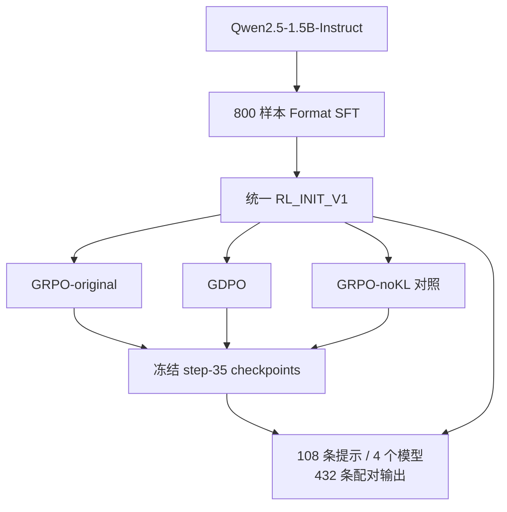

# ToolPostTrain：工具调用 LLM 后训练

[English](README.md) | **简体中文**

基于 **Qwen2.5-1.5B-Instruct、veRL/vLLM** 完成 **Format SFT + GRPO/GDPO** 后训练，追踪源码发现实际优化目标中的 KL 处理混杂，并设计匹配的 GRPO-noKL 对照。

**技术栈：** PyTorch · veRL · vLLM · LoRA · FSDP · 单张 RTX 6000D

**状态：** 已完成 SFT、三组 35-step RL 训练及四模型最终评估。

## 核心贡献（Core Contributions）

- **跑通真实 LLM 后训练：** 准备 **800 条 Format-SFT 样本**，构建统一 **RL_INIT_V1**，完成 **GRPO-original、GDPO、GRPO-noKL** 三组相同预算的训练。
- **通过源码发现比较混杂：** 追踪 **reward → advantage → actor loss → optimizer**，发现相同 KL 开关下的奖励消费路径不同；设计 **GRPO-noKL**，对齐优化目标层面的 KL 处理。
- **完成结果验证：** 在冻结评估中完成 **108 条提示 × 4 个模型 = 432 条输出**；三个 RL checkpoint 在当前内部 endpoint 上，相对初始化的 raw reward 均增加约 **+0.53**。

## 主要结果（Results）

每个模型在 **FINAL_HOLDOUT_V1** 的每条提示上生成一次贪心答案；均值与增量保留三位小数。

| 模型 | Raw total reward | 相对 RL_INIT 的增量 |
|---|---:|---:|
| RL_INIT_V1 | 2.417 | — |
| GRPO-original35 | 2.946 | +0.529 |
| GDPO-current35 | 2.956 | +0.540 |
| GRPO-noKL35 | 2.945 | +0.529 |

**GDPO − GRPO-noKL：+0.011。** 配对区间包含 0，当前实验未支持 GDPO 有清晰的额外收益。三个 RL−初始化的区间在当前 endpoint 上均高于 0。

Raw total reward 为正确性奖励 + 格式奖励，是 scorer 分数，**不是准确率百分比**。[完整配对 bootstrap 与分项结果 →](reports/final_holdout_v1/completion_report.md)

## 核心技术发现（Key Technical Finding）

> **相同配置开关，不代表相同优化目标。**

在固定版本的实现中，原始两组均开启 `use_kl_in_reward`，但 **GRPO 使用 KL 调整后的总奖励**，而当前配置的 **GDPO 路径直接用原始正确性/格式分项奖励构造 advantage**。因此，最初的比较同时混入了 advantage 构造与 KL 处理差异。

我补充 **GRPO-noKL** 作为优化目标层面的 KL 对齐参照，并保持初始化、数据顺序、训练预算和评估日程一致。[源码路径审计 →](docs/diagnostics/gdpo_hidden_kl_use_final_audit.md)

## 项目流程（Pipeline）



## 我的工作（What I Built）

| 贡献 | 具体工作 |
|---|---|
| **后训练流程** | 适配 Blackwell/SM120 环境与单卡启动配置，基于 veRL/vLLM 完成 Format SFT 和三组真实 RL 训练。 |
| **目标路径审计** | 追踪 reward tensors、component extras、advantage dispatch 和 actor loss，识别 KL 处理差异。 |
| **受控消融** | 增加 GRPO-noKL，核对其与原始运行的实际配置，控制主要 KL 混杂。 |
| **留出集评估** | 冻结四个模型身份与 108 条提示，完成 432 条输出的 scorer 检查及配对 bootstrap 分析。 |

算法与复现代码来自 **NVlabs/GDPO**，实际训练框架来自 **官方 veRL**，任务数据/奖励来自 **ToolRL**，基础模型来自 **Qwen**。我的贡献是环境适配、审计、对照和评估。

## 实验配置（Experimental Setup）

| 项目 | 设置 |
|---|---|
| 基础模型 / RL 初始化 | Qwen2.5-1.5B-Instruct / 合并后的 800 样本 Format SFT |
| 算法 | GRPO-original / GDPO / GRPO-noKL |
| RL 预算 | 每组 35 training steps；512 prompts/batch；每条 prompt 采样 4 条轨迹 |
| 学习率 / training seed | 1e-6 / 42 |
| 运行环境 | veRL + vLLM；单张 RTX 6000D |
| 最终评估 | 108 条提示 × 4 个模型；贪心 n=1 |

## 结果范围（Scope）

这是 **单 seed、35-step** 的实验，使用依据暴露审计从未进入 optimizer 的 train-split 尾部选取的**事后内部留出集**。当前结果不支持 GDPO 优越性、算法等价或跨 seed 稳健性；任务评估工具调用输出，没有真实工具执行。[Endpoint 来源与完整局限 →](reports/final_holdout_v1/completion_report.md)

## 深入阅读（Read More）

- [最终结果](reports/final_holdout_v1/completion_report.md)：精确指标与完整配对比较。
- [结果与证据索引](reports/README.md)：训练报告、KL 审计与最终协议。

全部 **432** 条输出通过冻结行映射与 scorer 重算检查。协议、身份与 hashes 见证据索引；原始输出、数据集和权重保留在 Git 之外。

<details>
<summary>仓库结构与本地检查</summary>

`configs/` 和 `manifests/` 保存配置与身份；`scripts/` 保存运行入口和检查；`reports/` 保存结果；`docs/` 保存协议与技术审计。上游代码树保留。

```bash
bash setup-local.sh
bash 运行本地验证.command
```

以上为本地 CPU 检查。历史 GPU launchers 依赖已记录的服务器目录布局与单独保存的数据/模型。

基于 [NVlabs/GDPO](https://github.com/NVlabs/GDPO)；参见[上游 README](README.upstream.md)、[LICENSE](LICENSE) 和[第三方许可证](third_party_dependency.LICENSE)。

</details>
