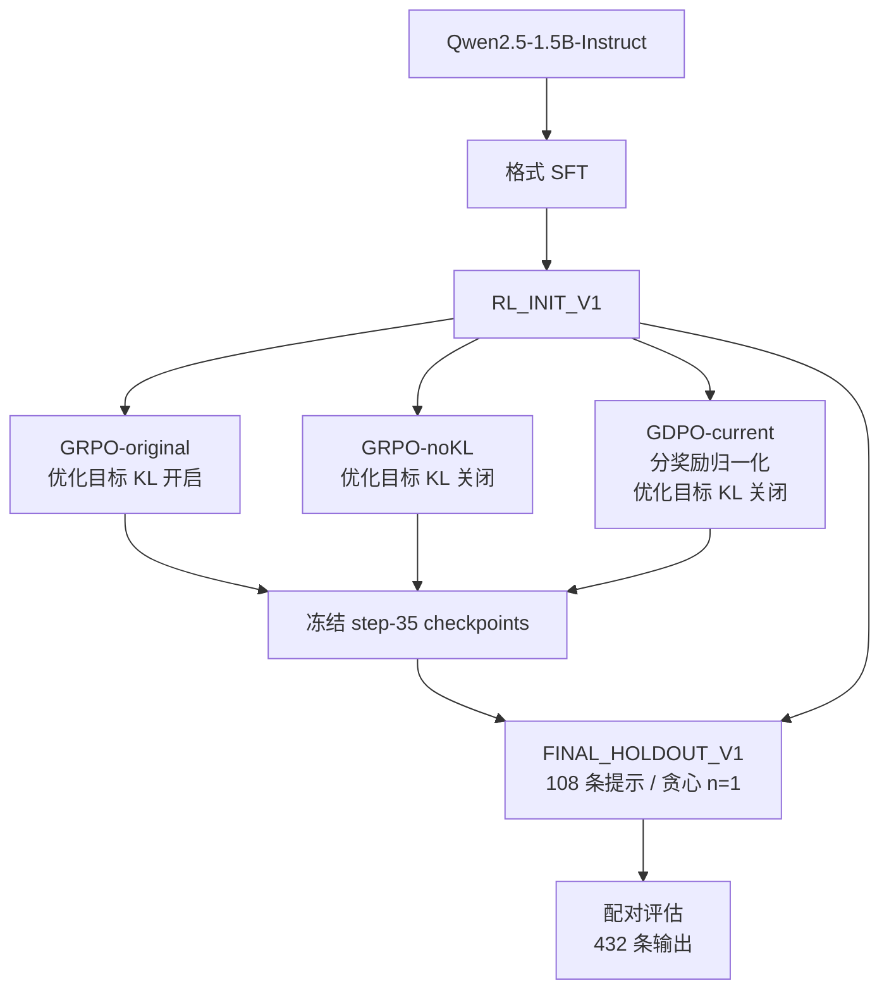

# ToolPostTrain

[English](README.md) | **简体中文**

### 工具调用多奖励 RL 后训练：复现与目标路径审计

**Format SFT → GRPO/GDPO → KL 路径审计 → 匹配的 noKL 消融 → 留出集配对评估**

大模型工具调用后训练：GRPO/GDPO 复现、KL 目标路径审计与受控消融。

**已完成：**三组 **35-step** RL 训练 · **108** 条内部留出集提示 · **432** 条正式生成输出。

[最终结果](reports/final_holdout_v1/completion_report.md) · [KL 目标审计](docs/diagnostics/gdpo_hidden_kl_use_final_audit.md) · [证据索引](reports/README.md)

## 项目亮点（Highlights）

- 在单张 **RTX 6000D** 上，基于现代 **veRL/vLLM** 完成 **Qwen2.5-1.5B-Instruct** 的真实 GRPO/GDPO 后训练。
- 构建轻量 **Format SFT** 阶段，为 ToolRL 严格输出契约建立统一 RL 初始化。
- 追踪 **reward → advantage → optimizer**，发现相同配置开关下，两种实现对 reward-side KL 的实际消费不同。
- 补充**匹配的 GRPO-noKL 对照**：三个 RL checkpoint 在当前内部 endpoint 上相对初始化的 raw reward 增量约为 **+0.53**，但未支持 GDPO 相对 KL 对齐参照具有清晰优势。

## 我的工作（What I Built）

**上游基础：**NVlabs/GDPO 提供算法与复现代码；官方 veRL 提供实际执行的训练框架；ToolRL 提供任务数据与奖励契约；Qwen 提供基础模型。

我的工程与研究贡献：

| 贡献 | 具体工作 |
|---|---|
| 现代训练环境 | 针对 Blackwell/SM120、FSDP、SDPA 和 vLLM 适配环境安装与启动配置；验证真实 optimizer 更新，并完成单卡训练。 |
| 统一 RL 初始化 | 审计 prompt 与 scorer 的契约；准备 800 条 Format-SFT 样本，执行一轮 LoRA 训练 / 50 次更新，并验证合并后的 **RL_INIT_V1**。 |
| 目标路径审计 | 追踪 reward tensors、raw component extras、advantage dispatch 与 policy loss，识别 **KL-treatment confound**。 |
| 受控消融 | 设计并运行 **GRPO-original35、GDPO-current35、GRPO-noKL35**，使用相同初始化、训练预算和评估日程。 |
| 机制诊断 | 在 shared rollouts 上比较 advantage，并在另一组 sampled diagnostic 中检查奖励维度冲突。 |
| 配对评估 | 冻结四个模型身份与内部 endpoint；完成 **432** 条输出、精确 scorer 复核及 paired-bootstrap 分析。 |

项目结合了上游算法复现与实现审计，检查实际优化目标究竟在比较什么。

## 研究问题（Research Question）

在已完成格式对齐的工具调用后训练中，GDPO 的分奖励 advantage 构造，能否比 **KL 对齐的 GRPO 参照**带来可测量的收益？

对于不含 reward-side KL 的比较，两种构造可简写为：

```text
R      = R_accuracy + R_format
A_GRPO = GroupNorm(R)
A_GDPO ≈ MaskedBatchWhiten(GroupNorm(R_accuracy) + GroupNorm(R_format))
```

GroupNorm 在同一 prompt 的 rollout group 内操作；GDPO 还会在有效 response tokens 上进行 batch whitening。流程图与公式概括的是完整构造；该比较没有把分维度归一化的作用与 batch whitening 单独分离。

## 项目流程（Pipeline）



这里的**优化目标 KL**指更新是否消费来自 reference policy 的奖励惩罚，不是配置开关本身，也不是 PPO 日志中的 KL 诊断指标。

## 主要结果（Main Results）

**FINAL_HOLDOUT_V1** 是冻结的**事后内部留出集（post-hoc internal holdout）**。评估在 35-step 预算和四个模型身份固定后执行；每个模型对相同的 **108** 条提示各生成一次贪心答案，共完成 **432/432** 条正式输出。

| 模型 | Raw total reward | 正确性奖励 | 格式奖励 | 相对 RL_INIT 的 total 增量 |
|---|---:|---:|---:|---:|
| RL_INIT_V1 | 2.416575 | 1.490650 | 0.925926 | — |
| GRPO-original35 | 2.945898 | 2.001453 | 0.944444 | +0.529322 |
| GDPO-current35 | 2.956086 | 2.002382 | 0.953704 | +0.539511 |
| GRPO-noKL35 | 2.945284 | 2.000839 | 0.944444 | +0.528708 |

表中数值来自原始 scorer；**accuracy reward 是正确性奖励分数，不是准确率百分比**。Total reward 为 accuracy reward + format reward，评估中不包含 reference-policy KL 惩罚。

重点 primary comparisons 如下，差值方向均明确写出：

| 比较 | 平均 total reward 差值 | Paired bootstrap 95% CI |
|---|---:|---:|
| GDPO − GRPO-noKL | +0.010802 | [−0.096605, +0.165432] |
| GRPO-original − RL_INIT | +0.529322 | [+0.303721, +0.788203] |
| GDPO − RL_INIT | +0.539511 | [+0.302045, +0.815225] |
| GRPO-noKL − RL_INIT | +0.528708 | [+0.303088, +0.782164] |

> **核心发现：**在当前固定内部 endpoint 上，三组 RL−初始化的区间均高于 0。三组 RL 方法之间的区间均包含 0；实验没有支持 GDPO 相对 KL 对齐 GRPO 具有清晰优势，也没有证明算法等价。

分析使用 **10,000 次共同的配对重采样**、seed 42 和 percentile intervals。区间描述固定 checkpoints 下的提示样本变异，不包含不同训练 seeds 的变异。[完整六组预先声明的比较与分项指标](reports/final_holdout_v1/metrics_and_paired_comparisons.json)均保留；上表仅用于阅读展示，没有修改分析。

## 为什么 KL 审计重要（Why the KL Audit Matters）

原始两组训练配置都设置了 `algorithm.use_kl_in_reward=true`，但实际执行路径不同：

```text
scorer → aggregate token_level_scores + raw accuracy/format components
       → token_level_rewards = token_level_scores − β × reference KL

GRPO → KL-adjusted token_level_rewards → group-normalized advantages
GDPO → raw accuracy_reward / format_reward → per-component norm → whitening
     → advantages → actor policy loss → optimizer update
```

在当前配置的 reward keys 下，GDPO 使用 raw components，而不是经过 KL 调整的 aggregate reward。三组训练均关闭独立的 actor KL loss。GDPO 仍计算 reference path，并记录 KL-adjusted statistics；但**开启 reward-side KL 开关，并没有使该惩罚进入当前 component-based objective**。

因此，**GRPO-original vs GDPO** 同时比较了 advantage 构造与 KL 处理。我补充了 **GRPO-noKL**，将 reward-side KL 开关设为 false，使其成为优化目标层面的 KL 对齐参照。

| 运行 | Advantage 构造 | Reward-side KL 是否进入更新 | 训练配置开关 |
|---|---|---|---|
| GRPO-original | Aggregate reward → group norm | 是 | `use_kl_in_reward=true` |
| GRPO-noKL | Aggregate reward → group norm | 否 | `use_kl_in_reward=false` |
| GDPO-current | Raw component norms → sum → masked whitening | 否，限于当前配置的 component 分支 | `use_kl_in_reward=true` |

**相同配置开关不足以证明优化目标相同。**[源码路径审计](docs/diagnostics/gdpo_hidden_kl_use_final_audit.md)与 [original/noKL 配置差异](docs/diagnostics/grpo_original_vs_grpo_nokl_effective_config_diff.md)记录了对照依据。按 veRL 的实现语义，关闭 reward KL 还会移除 reference-policy 计算，因此运行耗时差异不能视为纯 advantage estimator 的效率比较。

## 实验设计（Experimental Design）

| 共同设置 | 数值 |
|---|---|
| 模型 / 初始化 | Qwen2.5-1.5B-Instruct / 合并后的 Format-SFT **RL_INIT_V1** |
| 训练数据 | ToolRL `rlla_4k`：3,920 条原始样本 → 3,901 条合格样本；每 epoch 前 3,584 条进入训练 |
| 顺序 / batching | `shuffle=false`、`drop_last=true`；每个 training batch 为 512 条 prompts |
| 预算 | **35 training steps** = 5 epochs × 7 batches；每组均从 RL_INIT 重新开始 |
| Rollouts / PPO minibatch | 每条 prompt 采样 4 条轨迹 / 128 条 prompts |
| Optimizer / seed | AdamW，学习率 **1e-6** / **42**，一个 training seed |
| 长度上限 | Prompt **2,048** / response **1,024** tokens |
| 单卡执行 | FSDP；physical microbatch 1；dynamic token budget 6,144；vLLM TP=1 |
| 训练期间验证 | 固定 80 条 endpoint，在 steps 0/7/14/21/28/35 验证；贪心 n=1 |
| 最终评估 | 冻结 step35 模型 + RL_INIT；108 条样本；贪心 n=1、temperature=0 |

基础模型在[初始诊断](reports/sft/sft_v2_after_reward_report.md)中难以稳定满足 ToolRL 严格契约，因此先进行 Format SFT，再运行 RL。[SFT 报告](reports/sft/sft_v2_train_report.md)与[合并检查](reports/comparison/rl_init_merge_validation.md)记录了统一初始化；没有宣称 runtime-LoRA 与 merged outputs 逐位相同。

[训练曲线与 canonical validation scores](reports/comparison/grpo_gdpo_nokl_stage1_35_comparison.md)和上述最终结果分别展示。验证集已知的重复内容行由[事后 80/79 敏感性分析](reports/comparison/primary80_vs_sensitivity79_stage1_35.md)覆盖。[35-step 收尾决定](docs/experiment_design/stage1_closeout_decision.md)是预算决策，不是收敛结论。

## 机制诊断（Mechanism Diagnostics）

- **Shared rollouts：**在 8 条 prompts × 4 条轨迹上，GDPO 改变了 advantage 的幅度、中心化与样本权重。在报告规定的容差下，**没有实质组内排序反转**。[诊断与解释勘误](reports/comparison/grpo_gdpo_shared_rollout_diagnostic.md)。
- **奖励冲突：**另一组 sampled Format-SFT pilot 中，**8/128** 条轨迹的中心化正确性/格式奖励符号相反，涉及 **6/32** 个组。这是该诊断样本的测量结果，不代表正式训练的冲突频率。[奖励变化报告](reports/sft/fresh_holdout_reward_variation.md)。
- **合理但未证明的机制假设（plausible mechanism hypothesis）：**greedy validation 的格式分数较高，且已观察到的冲突有限，可能使分维度归一化改善 endpoint 分数的空间较小。Sampled rollouts 仍存在格式变化；未证明训练期格式饱和，也未建立因果解释。

诊断揭示实现行为，配对结果则限定可支持的下游结论。

## 技术深挖入口（Technical Deep Dives）

1. [为什么 GRPO/GDPO 的 KL 处理构成混杂](docs/diagnostics/gdpo_hidden_kl_use_final_audit.md)
2. [为什么需要 Format SFT，以及它改变了什么](reports/sft/sft_v2_after_reward_report.md)
3. [共享 rollouts 上的 GRPO/GDPO advantage 构造](reports/comparison/grpo_gdpo_shared_rollout_diagnostic.md)
4. [奖励维度冲突及其测量边界](reports/sft/fresh_holdout_reward_variation.md)
5. [最终配对评估、完整比较与解释](reports/final_holdout_v1/completion_report.md)

## 局限（Limitations）

- **一个 training seed、35 steps：**区间不衡量跨 seed 稳健性或更长训练预算下的行为。
- **事后内部留出集：**依据持久化暴露审计，从未进入 optimizer 的 train-split 尾部选取；与 validation 共享来源池。
- **任务范围：**内部工具调用评分任务，不是官方 unseen ToolRL test 或外部 benchmark。
- **目标范围：**GDPO/noKL 比较包括 whitening 在内的完整 advantage 构造；未单独识别分维度归一化的因果作用。
- **Agent 范围：**没有真实工具执行或交互式 Agent 环境；格式/解析奖励不衡量端到端任务成功。

## 复现与实验完整性（Reproducibility / Experimental Integrity）

最终矩阵每个模型均通过 **108/108 唯一 mapping**，没有缺失或重复行。全部 **432** 条输出均用固定 scorer 重算：奖励值有限，三个持久化 reward 字段的差异均为 **0**。评估没有训练或 optimizer 更新。

最终评估期间保留了执行失败现场，修复时没有重新生成已有模型答案，也没有修改冻结协议。[完成与技术审计报告](reports/final_holdout_v1/completion_report.md)记录了原有 RL_INIT 输出的保留及工程修复。

| 证据 | 入口 |
|---|---|
| 冻结 endpoint / runtime mapping | [Endpoint manifest](manifests/final_holdout_v1_manifest.json) · [Mapping](manifests/final_holdout_v1_runtime_mapping.json) |
| 冻结模型 / scorer | [模型身份](manifests/final_test_models_manifest.json) · [Scorer 身份](manifests/final_test_scorer_manifest.json) |
| 实际配置 / runtime | [Completion gate 中的完整性记录](reports/final_holdout_v1/completion_gate.json) · [Runtime 版本](reports/final_holdout_v1/runtime_environment.json) |
| 冻结协议 / 分析 | [协议](docs/experiment_design/final_test_protocol.md) · [分析脚本](scripts/analyze_final_test.py) |
| 私有归档验证 | [归档回执](reports/final_holdout_v1/archive_receipt.json) |
| 历史暴露 / 内容重叠 | [历史使用审计](docs/diagnostics/final_test_historical_usage_audit.md) · [Holdout 冻结审计](docs/diagnostics/final_holdout_v1_freeze_audit.md) |
| 展示表述核验 | [Claim audit](docs/diagnostics/github_presentation_claim_audit_20261003.md) |

实际执行框架：官方 veRL v0.9.1，commit `1876b06d0a3e4e71e06230be10af14492ca8a75b`。最终 launcher commit：`066e158639bcebdc79131e7ab0180d11ef021aaf`。文件和输出的 SHA256 保存在 completion gate 中。

Git 包含小型报告、configs、manifests 与审计代码。原始正式输出、数据集、权重和 optimizer state 有意保留在 Git 之外；私有评估归档已独立校验。公开 validation 汇总属于归档证据；本次展示修订没有重新计算其 bootstrap 或最终分析。

本地 CPU-only 检查入口：

```bash
bash setup-local.sh
bash 运行本地验证.command
```

历史 GPU launchers 依赖已记录的服务器目录布局及单独保存的数据/模型，不能作为可移植的一键复现入口。冻结实验已经完成。

## 仓库结构与来源（Repository Map & Attribution）

| 路径 | 用途 |
|---|---|
| `configs/`、`manifests/` | 已记录的配置与冻结身份 |
| `scripts/` | 环境安装、训练/评估入口与技术检查 |
| `reports/` | 结果、训练记录、目标审计与诊断 |
| `docs/` | 协议、实验设计、深入解释与[个人面试准备](docs/resume_project_summary.md) |
| `verl-GDPO/`、`trl-GDPO/`、`nemo_rl-GDPO/` | 保留的上游复现代码树 |

基于 [NVlabs/GDPO](https://github.com/NVlabs/GDPO)，固定 commit 为 `4ad86b4fbfc5db594f3a2750ff9c39fdc8ee6115`；参见 [README.upstream.md](README.upstream.md)。算法归功于上游；本项目贡献是上述环境适配、审计、对照与评估。许可证：[LICENSE](LICENSE) 与[第三方依赖许可证](third_party_dependency.LICENSE)。
